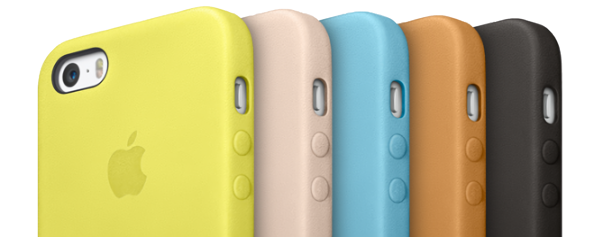

# 2013 | Leather 
For the iPhone 5s, iPad Air, and iPad mini with Retina Display, Apple released official leather cases made from premium aniline-dyed leather. These cases were designed to fit snugly on the devices while maintaining a relatively slim profile. They featured precise cutouts for buttons and ports, as well as a soft microfiber lining for added protection. 

These leather cases were designed to age beautifully, as the material develops a unique patina over time. This natural process enhances the appearance of the leather, giving it a rich and distinctive character that reflects its use and personal history. 

#### iPhone
Here's the iPhone lineup. These are compatible with iPhone 5, iPhone 5s, and iPhone SE (1st generation).

#### iPad mini
Here's the iPad mini lineup. These are compatible with iPad mini 1, 2 and 3, but not the next iPad minis.

#### iPad Air
Here's the iPad Air lineup. These are compatible with iPad Air 1, and with later introduced iPad (5th and 6th generation).

#### SKU Table
| Model             | Brown      | Beige      | Yellow     | Blue       | Black      | Red        |
|--------------------|------------|------------|------------|------------|------------|------------|
| iPad Mini Smart Case | ME706LL/A | ME707LL/A | ME708LL/A | ME709LL/A | ME710LL/A | ME711LL/A |
| iPad Air Smart Case  | MF047LL/A | MF048LL/A | MF049LL/A | MF050LL/A | MF051LL/A | MF052LL/A |
| iPhone 5s Case       | MF041LL/A | MF042LL/A | MF043LL/A | MF044LL/A | MF045LL/A | MF046LL/A |
